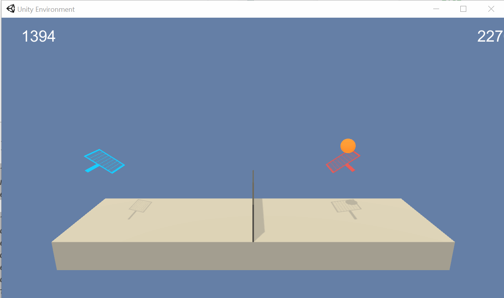

# Udacity DRLND Project 3: Collaboration and Competition
For this project, we will work with the Tennis environment.   

## Environment details
### What is the environment like?
In *Tennis*, two agents control rackets to bounce a ball over the net. If an agent hits the ball over the net, it receives a reward of 0.1. Letting the ball touch the ground ot hitting the ball out of the court gets the agent a reward of -0.01. The goal of the two agents is to keep the ball in play.

### The state and action spaces
The observation state for each agent consists of 24 continuous variables which represent several parameters relating to the position and velocity of the ball and racket. Each agent receives its own specific observation. The agents can perform two continuous actions: moving toward or away from the net and jumping. Both actions are bound within the interval [-1, 1]. 

### Task structure and solution
The task is episodic, with episodes beginning when the ball is dropped into the playing field and ending when it hits the ground or gets knocked out of bounds. The task is considered solved when an average score of +0.5 over 100 consecutive episodes is achieved. More concretely, at the end of each episode each agent receives a reward, meaning we likely have 2 different scores. You sould take the maximum of those 2 rewards to get the task score for that episode and it is this value which you average over 100 episodes to check if the task has been solved.

## Dependencies

**First**, reproduce my environment by following the instructions [here](https://github.com/udacity/deep-reinforcement-learning#dependencies).  
**Then**, clone this repository.  

### Project environment
**First** download the Unity environment from whichever link below matches your operating system:
- [Linux](https://s3-us-west-1.amazonaws.com/udacity-drlnd/P3/Tennis/Tennis_Linux.zip)
- [Mac OSC](https://s3-us-west-1.amazonaws.com/udacity-drlnd/P3/Tennis/Tennis.app.zip)
- [Windows (32-bit)](https://s3-us-west-1.amazonaws.com/udacity-drlnd/P3/Tennis/Tennis_Windows_x86.zip)
- [Windows (64-bit)](https://s3-us-west-1.amazonaws.com/udacity-drlnd/P3/Tennis/Tennis_Windows_x86_64.zip)  
    
**Then**, unzip the downloaded file into the same directory as the cloned repo. 
    
### Additional installations
- PyTorch 1.4.0
- Numpy 1.18.1
- Matplotlib 3.1.3

## How to use
This repo has a [Training Notebook](https://github.com/andrefmsmith/drlnd_CollabCompetSubmission/blob/master/Tennis_TrainCode.ipynb) with all the code to train the agent, a [Report](https://github.com/andrefmsmith/drlnd_CollabCompetSubmission/blob/master/Report.ipynb) explaining the approach used and [Checkpoints](https://github.com/andrefmsmith/drlnd_CollabCompetSubmission/tree/master/Model%20Checkpoints) to load a trained agent.  

After solving the dependencies and setting up the project, open the [Training Notebook](https://github.com/andrefmsmith/drlnd_CollabCompetSubmission/blob/master/Tennis_TrainCode.ipynb) and:
- Run 'Imports' cell;
- Run 'Unity environment & info' to instantiate the environment and retrieve necessary variables;
- Run/edit 'Hyperparameters' cell. Defaults work fine;
- Run every cell under 'DDPG agents' to define networks, their architectures and methods, as well as the Replay Buffer;
- Run cells 'Instantiate agent' and 'Define training function'
- Finally, run cell 'Train & save checkpoint to *path*', replacing the default value of path with your chosen filename prefix for the model checkpoints.
- Watch a trained agent:
    - If you trained a new agent using the notebook, skip to cell 'Watch the agent'
    - Alternatively, run the cell 'Load model' setting the variable appropriately to load parameters for either mine or your pre-trained model, then run cell 'Watch the agent'.
